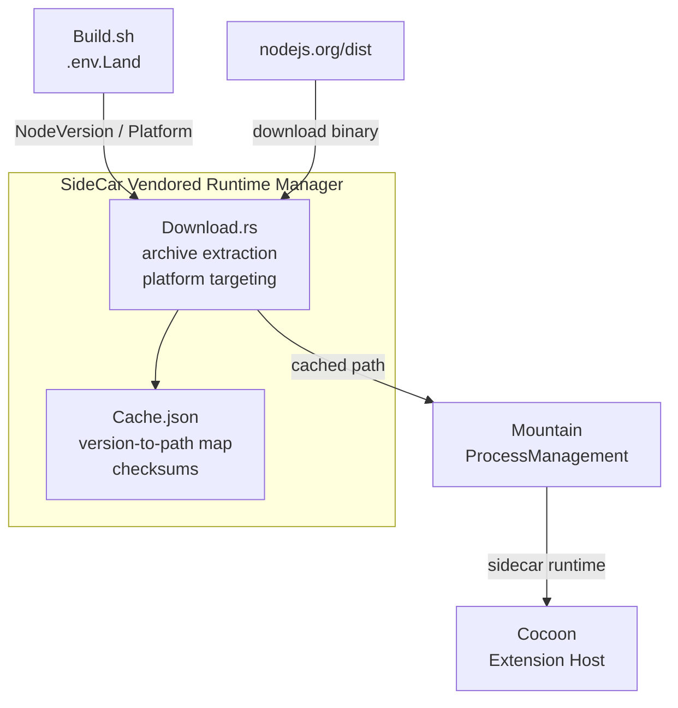

<table>
	<tr>
		<td colspan="1">
			<h3 align="center">
				<picture>
					<source media="(prefers-color-scheme: dark)" srcset="https://editor.land/Dark/Image/GitHub/Land.svg">
					<source media="(prefers-color-scheme: light)" srcset="https://editor.land/Image/GitHub/Land.svg">
					
				</picture>
			</h3>
		</td>
		<td colspan="3" valign="top">
			<h3 align="center"> SideCar 🚗</h3>
		</td>
	</tr>
</table>

---

# **SideCar** 🚗 Architecture

`SideCar` is the vendored runtime binary manager for `Land`:

- Handles download, caching, verification, and management of `Node.js` runtime
  binaries
- Supports multiple target platforms
- Integrates with `Mountain` at both build time and runtime

---

## Table of Contents

1. [Overview](#overview)
2. [Architecture](#architecture)
3. [Binary Resolution](#binary-resolution)
4. [Download System](#download-system)
5. [Supported Platforms](#supported-platforms)
6. [Caching Strategy](#caching-strategy)
7. [Related Documentation](#related-documentation)

---



## Overview 📋

`SideCar` is a `Rust` library and binary that manages pre-compiled native
dependency binaries for `Land`:

- Currently handles `Node.js` runtime binaries
- Downloads them from official sources
- Makes them available to `Mountain` at build time and runtime

| Attribute    | Value                                                                 |
| ------------ | --------------------------------------------------------------------- |
| Language     | `Rust` (edition 2024)                                                 |
| Crate type   | Library + Binary                                                      |
| Dependencies | `tokio`, `reqwest`, `serde`, `zip`, `tar`, `flate2`, `Common`, `Mist` |
| Consumed by  | `Mountain` (build-time binary selection)                              |
| Storage      | `SideCar/Cache.json` + per-platform cached binaries                   |

---

## Architecture 🏗️

```
+---------------------------------------------------------------+
|                        SideCar                                 |
|                                                                |
|  +----------------------+                                      |
|  | Download.rs          |                                      |
|  | - Archive extraction |                                      |
|  | - Platform targeting |                                      |
|  | - Version resolution |                                      |
|  +----------------------+                                      |
|                                                                |
|  +----------------------+                                      |
|  | Cache.json           |                                      |
|  | - Version-to-path    |                                      |
|  |   mapping            |                                      |
|  | - Checksums          |                                      |
|  +----------------------+                                      |
+---------------------------------------------------------------+
```

### Module Map 🗺️

| Path                 | Purpose                                                 |
| :------------------- | :------------------------------------------------------ |
| `Source/Download.rs` | Binary download, archive extraction, platform targeting |
| `Source/Library.rs`  | Library root                                            |
| `Source/main.rs`     | Binary entry point for standalone operation             |

---

## Binary Resolution 🔍

The resolution process selects the correct `Node.js` binary for the target
platform:

```
Build.sh reads NodeVersion and NodePlatform from .env.Land
    |
    v
SideCar::resolve()
    |
    +---> Check SideCar/Cache.json for cached binary
    |       |
    |       +---> CACHED: Return cached path
    |       |
    |       +---> NOT CACHED: Continue
    |
    +---> Determine target platform string
    |       - darwin-arm64 (Apple Silicon)
    |       - darwin-x64 (Intel)
    |       - linux-arm64
    |       - linux-x64
    |
    +---> Construct download URL:
    |       https://nodejs.org/dist/v{version}/node-v{version}-{platform}.tar.gz
    |
    +---> Download binary (via Download.rs)
    +---> Verify SHA-256 checksum
    +---> Extract to SideCar/{platform}/node
    +---> Record in Cache.json
    |
    v
Return resolved binary path to Mountain
```

### Version Resolution Priority 📊

1. `NodeVersion` environment variable (explicit version override)
2. `SideCar/Cache.json` latest cached version
3. `Node.js` LTS version (fallback default)

---

## Download System 📥

The `Download` module handles archive retrieval and extraction:

| Operation            | Description                                                   |
| -------------------- | ------------------------------------------------------------- |
| URL construction     | Builds platform-specific download URL from version + platform |
| HTTP download        | Streaming download with timeout and retry                     |
| SHA-256 verification | Checksum verification against published hash                  |
| Archive extraction   | `.tar.gz` decompression with platform prefix stripping        |
| Binary placement     | Single binary extracted to `SideCar/{platform}/node`          |

### Download Flow 📋

```
1. HTTP GET to https://nodejs.org/dist/v{version}/SHASUMS256.txt
2. Parse SHASUMS256.txt for target binary hash
3. HTTP GET to https://nodejs.org/dist/v{version}/node-v{version}-{platform}.tar.gz
4. Stream to temporary download file with progress tracking
5. SHA-256 hash computed during download
6. Verify hash against published checksum
7. Extract node binary from archive
8. Move binary to SideCar/{platform}/node
9. Update Cache.json
```

---

## Supported Platforms

| Target Triple               | Platform String | Archive Pattern                       |
| --------------------------- | --------------- | ------------------------------------- |
| `aarch64-apple-darwin`      | `darwin-arm64`  | `node-v{version}-darwin-arm64.tar.gz` |
| `x86_64-apple-darwin`       | `darwin-x64`    | `node-v{version}-darwin-x64.tar.gz`   |
| `aarch64-unknown-linux-gnu` | `linux-arm64`   | `node-v{version}-linux-arm64.tar.gz`  |
| `x86_64-unknown-linux-gnu`  | `linux-x64`     | `node-v{version}-linux-x64.tar.gz`    |

---

## Caching Strategy 💾

`SideCar` maintains a JSON-based cache manifest at `SideCar/Cache.json`:

```json
{
	"version": "1",
	"entries": {
		"22.0.0-darwin-arm64": {
			"path": "aarch64-apple-darwin/node",
			"sha256": "e3b0c44298fc1c149afbf4c8996fb92427ae41e4649b934ca495991b7852b855",
			"downloaded_at": "2026-01-15T10:30:00Z",
			"size": 68700000
		}
	}
}
```

| Cache Key       | Value                  | Description                         |
| --------------- | ---------------------- | ----------------------------------- |
| Version key     | `{version}-{platform}` | Uniquely identifies a binary        |
| `path`          | Relative path          | Location of cached binary           |
| `sha256`        | Hex string             | Checksum for integrity verification |
| `downloaded_at` | ISO 8601               | Timestamp of download               |
| `size`          | Bytes                  | Binary file size                    |

Cache entries are invalidated when:

- A new version is requested that differs from the cached version
- SHA-256 verification fails on the cached binary
- The cache file is manually cleared

---

## Related Documentation 📚

- [Mountain](https://github.com/CodeEditorLand/Mountain/tree/Current/Documentation/GitHub/Architecture.md) -
  Main backend (binary consumer)
- [Mist](https://github.com/CodeEditorLand/Mist/tree/Current/Documentation/GitHub/Architecture.md) -
  DNS isolation for spawned processes
- [BuildPipeline](https://github.com/CodeEditorLand/Land/tree/Current/Documentation/GitHub/BuildPipeline.md) -
  Build pipeline integration
- [RustInfrastructure](https://github.com/CodeEditorLand/Land/tree/Current/Documentation/GitHub/RustInfrastructure.md) -
  `Rust` backend components

---

## Shim Compatibility

| 🟠 Low-Level Shim | 🔵 Coverage Shim |
|-------------------|-----------------|
| Tier: `TierShim=Own\|Preempt` | Tier: `TierShim=Proxy\|Replace` |
| Engine prototype hooks | Service routing + audit |
| Error, Emitter, Cancel, Dispose, Async, Timing | IPC SwallowMap, DI proxy, AuditLog |

> This Element supports the Land deep-shim interception system. The shim
> intercepts VS Code engine events at both the JavaScript prototype level (🟠 orange)
> and the application service level (🔵 blue). Gated behind `TierShim` env var
> (default: `None` — zero overhead). See the [Shim documentation](/doc/low-level-shim).

**Shim Modules:** No shim-specific modules — events routed through `Wind`/`Mountain`/`Cocoon`.

---

**Project Maintainers:** Source Open
([Source/Open@Editor.Land](mailto:Source/Open@Editor.Land)) |
[GitHub Repository](https://github.com/CodeEditorLand/SideCar) |
[Report an Issue](https://github.com/CodeEditorLand/SideCar/issues)
