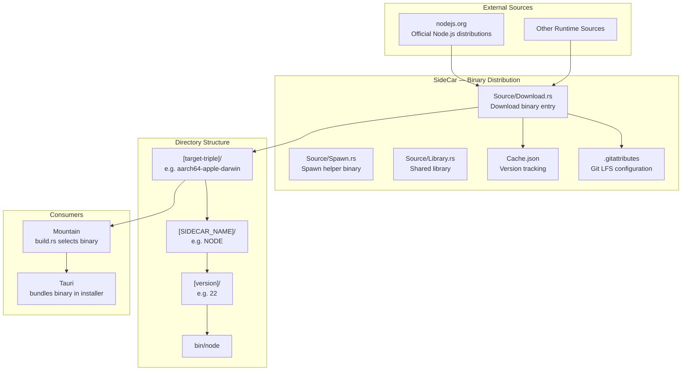
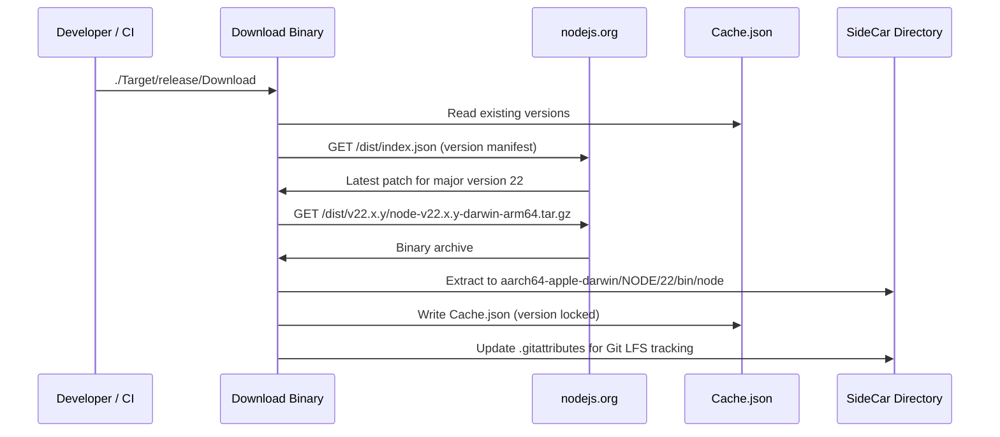

# SideCar — Deep Dive

This document provides the technical foundation for the SideCar binary
distribution layer within the Land ecosystem. **SideCar** manages pre-compiled,
platform-specific runtime binaries (primarily Node.js) so that the Land editor
can bundle vendored runtimes without requiring users to install them separately.

---

## Architecture

SideCar is a Rust workspace containing a download tool and a spawn helper. The
download tool fetches official runtime distributions and organizes them under a
target-triple directory convention. The spawn helper is used by Mountain to
launch sidecars from the vendored binary store.

---

## Key Modules

| Path | Description |
| :--- | :--- |
| `Source/Download.rs` | Main download binary: fetches runtime distributions, resolves versions, organizes by target triple |
| `Source/Spawn.rs` | Spawn helper: invoked by Mountain to launch a sidecar binary from the vendored store |
| `Source/Library.rs` | Shared library code: version resolution utilities, path helpers, cache types |
| `Source/Source/` | Internal module source files for the library |
| `Cache.json` | Tracks which versions have been downloaded per target triple to avoid redundant fetches |
| `.gitattributes` | Configured by the download tool to register large binary files with Git LFS |

---

## Data Flow

**Build-time selection:**

Mountain's `build.rs` reads the SideCar directory, selects the binary matching
the current Tauri build target triple, and copies it into the Tauri `sidecar`
resource path for bundling into the application installer.

---

## Integration Points

| Connecting Element | Direction | Mechanism | Description |
| :--- | :--- | :--- | :--- |
| **Mountain** | Consumer | `build.rs` file copy | Mountain's build script selects the correct Node.js binary by target triple |
| **Tauri** | Consumer | Sidecar resource bundling | Tauri bundles the selected binary into the platform installer |
| **Cocoon** | Runtime dependency | Spawned process | Mountain spawns Cocoon using the vendored Node.js binary from the SideCar store |
| **Air** | Potential consumer | Same convention | Additional daemon binaries may be vendored using the same target-triple structure |

---

## Configuration

| Parameter | Convention / Value | Description |
| :--- | :--- | :--- |
| Directory structure | `[target-triple]/[NAME]/[version]/bin/` | Standard layout for deterministic build-time binary selection |
| Target triples | `x86_64-pc-windows-msvc`, `aarch64-apple-darwin`, `x86_64-unknown-linux-gnu`, etc. | All Tauri-supported platform identifiers |
| Node.js major version | `22` (current default) | Controlled by the `--node-version` build flag |
| Cache file | `Cache.json` | JSON map of `{ "[triple]/[name]/[major]": "[resolved-version]" }` |
| Git LFS | `.gitattributes` auto-updated | All `*.node`, `node`, `node.exe` binaries tracked via LFS |

The SideCar directory is not committed to version control in its populated
form. Developers run the Download tool once during initial project setup, and
CI environments run it as part of the release pipeline.
