# **SideCar**&#x2001;🏍️

<table>
	<tr>
		<td>
			<a href="https://GitHub.Com/CodeEditorLand/SideCar" target="_blank">
				<picture>
					<source media="(prefers-color-scheme: dark)" srcset="https://img.shields.io/github/last-commit/CodeEditorLand/SideCar?label=Last-commit&color=black&labelColor=black&logoColor=white&logoWidth=0" />
					<source media="(prefers-color-scheme: light)" srcset="https://img.shields.io/github/last-commit/CodeEditorLand/SideCar?label=Last-commit&color=white&labelColor=white&logoColor=black&logoWidth=0" />
					
				</picture>
			</a>
			<br />
			<a href="https://GitHub.Com/CodeEditorLand/SideCar" target="_blank">
				<picture>
					<source media="(prefers-color-scheme: dark)" srcset="https://img.shields.io/github/issues/CodeEditorLand/SideCar?label=Issues&color=black&labelColor=black&logoColor=white&logoWidth=0" />
					<source media="(prefers-color-scheme: light)" srcset="https://img.shields.io/github/issues/CodeEditorLand/SideCar?label=Issues&color=white&labelColor=white&logoColor=black&logoWidth=0" />
					
				</picture>
			</a>
		</td>
		<td>
			<a href="https://github.com/CodeEditorLand/SideCar" target="_blank">
				<picture>
					<source media="(prefers-color-scheme: dark)" srcset="https://img.shields.io/github/stars/CodeEditorLand/SideCar?style=flat&label=Star&logo=github&color=black&labelColor=black&logoColor=white&logoWidth=0" />
					<source media="(prefers-color-scheme: light)" srcset="https://img.shields.io/github/stars/CodeEditorLand/SideCar?style=flat&label=Star&logo=github&color=white&labelColor=white&logoColor=black&logoWidth=0" />
					
				</picture>
			</a>
			<br />
			<a href="https://GitHub.Com/CodeEditorLand/SideCar" target="_blank">
				<picture>
					<source media="(prefers-color-scheme: dark)" srcset="https://img.shields.io/github/downloads/CodeEditorLand/SideCar?label=Downloads&color=black&labelColor=black&logoColor=white&logoWidth=0" />
					<source media="(prefers-color-scheme: light)" srcset="https://img.shields.io/github/downloads/CodeEditorLand/SideCar?label=Downloads&color=white&labelColor=white&logoColor=black&logoWidth=0" />
					
				</picture>
			</a>
		</td>
	</tr>
</table>

Prebuilt `Node.js` Sidecar for Land&#x2001;🏞️

> **VS Code ships one `Node.js` binary and detects the platform at runtime, with
> fallback chains that fail in edge cases — Alpine Linux, custom glibc versions,
> ARM configurations. SideCar packages the exact `Node.js` binary for each
> target triple at compile time, so `Cocoon` always gets the binary that matches
> the host. No runtime detection, no fallback chains, no surprises.**

_"The right binary, for the right platform, at the right time."_

[](https://github.com/CodeEditorLand/SideCar/blob/Current/LICENSE)
[](https://www.rust-lang.org/)&#x2001;[](https://crates.io/crates/sidecar)
[](https://www.rust-lang.org/)&#x2001;[](https://www.rust-lang.org/)
[](https://nodejs.org/)

**[Rust API Documentation](https://rust.documentation.sidecar.editor.land/)**&#x2001;📖

---

## Overview

**SideCar** is the prebuilt `Node.js` sidecar repository for the **Land** Code
Editor. It packages platform-specific `Node.js` binaries organized by target
triple so that `Cocoon` — Land's `Node.js` extension host — receives the exact
runtime binary that matches the target platform. SideCar replaces runtime
detection and fallback chains with a single deterministic lookup at build time.

VS Code ships one `Node.js` binary and detects the platform at runtime — a
strategy that breaks on Alpine Linux, custom glibc versions, and ARM
configurations. SideCar eliminates this class of failure entirely by bundling
the correct binary per target triple at compile time.

**SideCar is engineered to:**

1. **Provide Portable Runtimes** — Ship vendored `Node.js` binaries that
   eliminate user dependency requirements and system-`Node.js` coupling.
2. **Enable Deterministic Builds** — Organize binaries by target triple for
   build-time binary selection with no runtime detection.
3. **Support Multiple Platforms** — Comprehensive matrix for `macOS`, `Linux`,
   and `Windows` on `x86_64` and `aarch64` architectures.
4. **Automate Download Management** — Automated fetching, caching, and `Git LFS`
   management of runtime binaries via the `Download` Rust tool.

---

## Key Features&#x2001;🔐

**Deterministic Binary Selection** — Binaries are organized by target triple
(`aarch64-apple-darwin/`, `x86_64-unknown-linux-gnu/`, etc.). `Mountain`'s
`build.rs` selects the correct binary at compile time — `Cocoon` receives a
path, never a guess.

**Concurrent Downloads** — The `Download` Rust binary uses `Tokio` for parallel
fetching of multiple runtime binaries from `nodejs.org`, maximizing throughput
across the full platform matrix.

**Intelligent Caching** — `Cache.json` tracks downloaded versions per target
triple. Subsequent runs skip already-fetched binaries, avoiding redundant
downloads and enabling incremental updates.

**Version Resolution** — Automatic resolution of major versions (e.g., `22`) to
the latest patch release from `nodejs.org` distribution feeds. No manual version
pinning required.

**`Git LFS` Integration** — Automatic `.gitattributes` management for large
binary tracking. The `Download` tool updates `Git LFS` pointers, keeping the
repository lean while binaries remain accessible.

**Platform Matrix** — Full coverage for `x86_64` and `aarch64` across `macOS`
(`apple-darwin`), `Linux` (`unknown-linux-gnu`), and `Windows`
(`pc-windows-msvc`).

---

## Core Architecture Principles&#x2001;🏗️

| Principle                  | Description                                                                                                                                             | Key Components                                           |
| -------------------------- | ------------------------------------------------------------------------------------------------------------------------------------------------------- | -------------------------------------------------------- |
| **Deterministic Delivery** | Package the exact `Node.js` binary per target triple at compile time. No runtime detection, no fallback chains, no surprises.                           | `build.rs`, target-triple directories, `Cache.json`      |
| **Build-Time Integration** | `Mountain`'s build system selects the correct binary from SideCar during the Tauri installer build. `Cocoon` receives a path, never a runtime decision. | `build.rs` binary selection logic, `Source/Download.rs`  |
| **Automated Sourcing**     | Fetch, verify, and cache official `Node.js` distributions with parallel `Tokio` downloads and intelligent version resolution.                           | `Source/Download.rs`, `Cache.json`, `.gitattributes`     |
| **Platform Completeness**  | Cover every target triple Land ships on — no edge case left to a runtime fallback.                                                                      | Target-triple directory layout, versioned subdirectories |

---

## System Architecture&#x2001;

```mermaid
graph LR
    classDef sidecar   fill:#d0d8ff,stroke:#4a6fa5,stroke-width:2px,color:#001050;
    classDef external  fill:#ebebeb,stroke:#888,stroke-width:1px,stroke-dasharray:5 5,color:#333;
    classDef storage   fill:#cce8ff,stroke:#2980b9,stroke-width:1px,color:#003050;
    classDef mountain  fill:#f0d0ff,stroke:#9b59b6,stroke-width:2px,color:#2c0050;
    classDef cocoon    fill:#d0f0d0,stroke:#27ae60,stroke-width:1px,color:#0a3a0a;

    subgraph SOURCES["External Sources"]
        NodeJSOrg["nodejs.org&#x2001;official distributions"]:::external
    end

    subgraph SIDECAR["SideCar 🏍️ - Prebuilt Node.js Sidecar"]
        direction TB
        subgraph TOOL["Source/ - Download Tool (Rust binary)"]
            DownloadBin["Download.rs&#x2001;⬇&#x2001;fetch · verify · organise&#x2001;Tokio parallel downloads"]:::sidecar
            CacheJSON["Cache.json&#x2001;💾&#x2001;version tracking&#x2001;skip redundant downloads"]:::sidecar
            GitLFS[".gitattributes&#x2001;📦&#x2001;Git LFS pointers&#x2001;for large binaries"]:::sidecar
            DownloadBin --> CacheJSON
            DownloadBin --> GitLFS
        end
        subgraph LAYOUT["Target-Triple Layout"]
            Darwin_ARM["aarch64-apple-darwin/&#x2001;🍎&#x2001;Apple Silicon"]:::storage
            Darwin_x86["x86_64-apple-darwin/&#x2001;🖥&#x2001;macOS Intel"]:::storage
            Win_x86["x86_64-pc-windows-msvc/&#x2001;🪟&#x2001;Windows x64"]:::storage
            Win_ARM["aarch64-pc-windows-msvc/&#x2001;🪟&#x2001;Windows ARM64"]:::storage
            Linux_ARM["aarch64-unknown-linux-gnu/&#x2001;🐧&#x2001;Linux ARM64"]:::storage
            Linux_x86["x86_64-unknown-linux-gnu/&#x2001;🐧&#x2001;Linux x64"]:::storage
        end
        BuildRS["build.rs&#x2001;🔧&#x2001;binary selection at build time&#x2001;stages correct triple into installer"]:::sidecar

        DownloadBin --> LAYOUT
        BuildRS --> LAYOUT
    end

    subgraph CONSUMERS["Consumers at Runtime"]
        Mountain["Mountain ⛰️&#x2001;build.rs bundles chosen binary&#x2001;into Tauri installer"]:::mountain
        Cocoon["Cocoon 🦋&#x2001;receives correct Node.js binary&#x2001;no runtime detection needed"]:::cocoon
    end

    NodeJSOrg --> DownloadBin
    LAYOUT --> BuildRS
    BuildRS --> Mountain
    Mountain -- spawns with Spawn.rs --> Cocoon
```



**Data flow paths:**

| Path                            | Mechanism                    | Description                                                  |
| ------------------------------- | ---------------------------- | ------------------------------------------------------------ |
| `nodejs.org` → `Download`       | HTTP fetch via `reqwest`     | Official `Node.js` distribution archives fetched in parallel |
| `Download` → Target directories | Filesystem extraction        | Archives extracted and organized by target triple            |
| `Download` → `Cache.json`       | `serde_json` serialization   | Version metadata written to avoid redundant downloads        |
| `Download` → `.gitattributes`   | File write                   | `Git LFS` tracking rules updated for large binaries          |
| Target directories → `build.rs` | Filesystem read              | Build script selects correct binary for the target triple    |
| `build.rs` → `Mountain`         | Cargo build integration      | Selected binary staged into the Tauri installer bundle       |
| `Mountain` → `Cocoon`           | Process spawn via `Spawn.rs` | Correct `Node.js` binary launched at runtime                 |

---

## Key Components

| Component      | Path                       | Description                                                                       |
| -------------- | -------------------------- | --------------------------------------------------------------------------------- |
| Download Tool  | `Source/Download.rs`       | Main binary: fetches, verifies, and organizes platform binaries from `nodejs.org` |
| Library        | `Source/Library.rs`        | Module declarations and shared utilities                                          |
| Binary Entry   | `Source/main.rs`           | Binary entry point for the download tool                                          |
| Build Script   | `build.rs`                 | Binary selection and staging for the Tauri installer; reads `Cargo.toml` version  |
| DNS Override   | `Resource/dns-override.js` | Shared `Node.js` resource for DNS resolution customization                        |
| Cache          | `Cache.json`               | Download cache metadata tracking fetched versions per target triple               |
| Git Attributes | `.gitattributes`           | `Git LFS` pointer rules for large binary tracking                                 |

---

## Project Structure&#x2001;🗺️

```
Element/SideCar/
├── Source/
│   ├── Download.rs              # Main download binary: fetch, verify, organize
│   ├── Library.rs               # Module declarations and shared utilities
│   └── main.rs                  # Binary entry point
├── build.rs                     # Build script: binary selection and staging
├── Cache.json                   # Download cache metadata (version tracking)
├── .gitattributes               # Git LFS pointer rules for large binaries
├── Resource/
│   └── dns-override.js          # DNS resolution customization resource
├── aarch64-apple-darwin/        # macOS Apple Silicon binaries
├── x86_64-apple-darwin/         # macOS Intel binaries
├── x86_64-pc-windows-msvc/      # Windows x64 binaries
├── aarch64-pc-windows-msvc/     # Windows ARM64 binaries
├── aarch64-unknown-linux-gnu/   # Linux ARM64 (glibc) binaries
├── x86_64-unknown-linux-gnu/    # Linux x64 (glibc) binaries
├── Temporary/                   # Temporary workspace for downloads
├── Documentation/
│   ├── GitHub/                  # GitHub-specific documentation
│   │   ├── Architecture.md      # Detailed architecture document
│   │   └── DeepDive.md          # Technical deep-dive
│   └── Rust/                    # Cargo doc output
└── Cargo.toml
```

---

## In the Land Project

SideCar vendored binaries are the compile-time source of truth for `Cocoon`'s
`Node.js` runtime. During the application build, `Mountain`'s `build.rs`
orchestrator selects the correct binary from SideCar based on the target triple.
`Cocoon` receives a deterministic path — no runtime detection, no fallback
chains, no platform-specific edge cases.

| Consumer     | Language                   | How SideCar Delivers                              | Integration Point                                              |
| ------------ | -------------------------- | ------------------------------------------------- | -------------------------------------------------------------- |
| **Cocoon**   | `TypeScript`, `JavaScript` | Platform-matched `Node.js` binary at a known path | `Mountain`'s `build.rs` bundles the binary; `Cocoon` spawns it |
| **Mountain** | `Rust` / `Tauri`           | Selected binary staged into the Tauri installer   | `build.rs` reads target-triple directory at compile time       |

The `Download` Rust binary populates the SideCar directory structure once during
project setup by fetching official distributions from `nodejs.org` and
organizing them by target triple convention. Subsequent runs only fetch new or
updated versions.

---

## Getting Started&#x2001;🚀

### Prerequisites

- **Rust** 1.75 or later
- `Git LFS` installed and configured (for binary tracking)

### Build the Download Tool

```bash
cd Element/SideCar
cargo build --release
```

### Run the Download Tool

```bash
# Fetch and organize all platform binaries
./Target/release/Download
```

### Usage Pattern

The SideCar directory is populated once during project setup:

1. **Build Download Tool:** Compile the `Download` binary from
   `Source/Download.rs`
2. **Run Download:** Execute to fetch and organize all runtime binaries
3. **Build Mountain:** The build system selects appropriate binaries from
   SideCar at compile time

> [!NOTE] The target-triple directories (`aarch64-apple-darwin/`,
> `x86_64-unknown-linux-gnu/`, etc.) are populated by the `Download` Rust binary
> and contain large, third-party binaries. These directories **should not be
> committed directly to version control** — use `Git LFS` via the auto-managed
> `.gitattributes` file. The `Download` tool should be run once to vendor the
> dependencies as part of the initial project setup.

---

## Security&#x2001;🔒

SideCar enforces binary integrity at multiple layers:

| Layer                     | Mechanism                                                                                                                     |
| ------------------------- | ----------------------------------------------------------------------------------------------------------------------------- |
| **Source of Truth**       | Binaries are fetched exclusively from `nodejs.org` official distribution feeds — no third-party mirrors                       |
| **Checksum Verification** | `Download` Rust binary validates SHA-256 checksums against `nodejs.org` published hashes before extraction                    |
| **Build-Time Selection**  | `Mountain`'s `build.rs` selects the exact binary for the target triple at compile time — runtime substitution is not possible |
| **Git LFS Integrity**     | Large binaries tracked through `Git LFS` with auto-managed `.gitattributes` pointer rules                                     |

---

## Compatibility

SideCar is designed to integrate with:

| Target         | Integration                                                                        |
| -------------- | ---------------------------------------------------------------------------------- |
| **Cocoon**     | Provides the exact `Node.js` binary at a deterministic path — no runtime detection |
| **Mountain**   | Binary selected at compile time via `build.rs`; staged into Tauri installer        |
| **nodejs.org** | Official distribution source; version resolution via download index                |
| **Git LFS**    | Large binary tracking via auto-managed `.gitattributes`                            |

---

## API Reference

- **[Rust API Documentation](https://rust.documentation.sidecar.editor.land/)**&#x2001;📖

---

## Related Documentation

- [Architecture Overview](https://Editor.Land/Doc/architecture) — Land system
  architecture
- [Why Rust](https://Editor.Land/Doc/why-rust) — Why `Rust` for the download
  tooling
- [Mountain](https://github.com/CodeEditorLand/Mountain) — Native desktop shell
- [Cocoon](https://github.com/CodeEditorLand/Cocoon) — `Node.js` extension host

---

## Funding & Acknowledgements&#x2001;🙏🏻

This project is funded through
[NGI0 Commons Fund](https://NLnet.NL/commonsfund), a fund established by
[NLnet](https://NLnet.NL) with financial support from the European Commission's
Next Generation Internet program, under grant agreement No 101135429.

The project is operated by PlayForm, based in Sofia, Bulgaria. PlayForm acts as
the open-source steward for Code Editor Land under the NGI0 Commons Fund grant.

<table>
	<tbody>
		<tr>
			<td align="left" valign="middle">
				<a href="https://Editor.Land">
					
				</a>
			</td>
			<td align="left" valign="middle">
				<a href="https://PlayForm.Cloud">
					
				</a>
			</td>
			<td align="left" valign="middle">
				<a href="https://NLnet.NL">
					
				</a>
			</td>
			<td align="left" valign="middle">
				<a href="https://NLnet.NL/commonsfund">
					
				</a>
			</td>
		</tr>
	</tbody>
</table>
