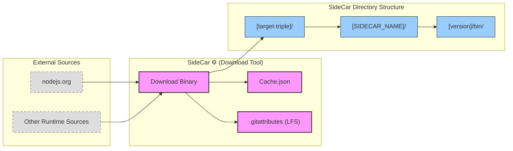

<table>
<tr>
<td align="left" valign="middle">
<h3 align="left"> SideCar</h3>
</td>
<td align="left" valign="middle">
<h3 align="left">
 ⚙️
</h3>
</td>
<td align="left" valign="middle">
<h3 align="left">+</h3>
</td>
<td align="left" valign="middle">
<h3 align="left">
<a href="https://Editor.Land" target="_blank">
<picture>
<source media="(prefers-color-scheme: dark)" srcset="https://PlayForm.Cloud/Dark/Image/GitHub/Land.svg">
<source media="(prefers-color-scheme: light)" srcset="https://PlayForm.Cloud/Image/GitHub/Land.svg">

</picture>
</a>
</h3>
</td>
<td align="left" valign="middle">
<h3 align="left">
<a href="https://Editor.Land" target="_blank">
Land
</a>
</h3>
</td>
<td align="left" valign="middle">
<h3 align="left">🏞️</h3>
</td>
</tr>
</table>


---

# **SideCar**&#x2001;⚙️

> **VS Code ships one Node.js binary and detects the platform at runtime, with fallback chains that fail in edge cases (Alpine Linux, custom glibc versions, ARM configurations).**

_"The right Node.js binary. Compiled in. No detection."_

SideCar packages the exact Node.js binary for each target triple at compile time: `aarch64-apple-darwin`, `x86_64-pc-windows-msvc`, and four others. Cocoon always gets the binary that matches the host. No runtime detection, no fallback chains, no surprises.

📖 **[Rust API Documentation](https://Rust.Documentation.Editor.Land/SideCar/)**

---

## What It Does&#x2001;🔐

- **Compile-time selection.** The correct binary for each target triple is selected at build time.
- **Six target triples.** aarch64-apple-darwin, x86_64-pc-windows-msvc, and four others.
- **No fallback chains.** Cocoon always gets exactly the right binary. No runtime detection.

---

## In the Ecosystem&#x2001;⚙️ + 🏞️



---

## Project Structure&#x2001;🗺️

```
SideCar/
└── [target-triple]/
    └── [SIDECAR_NAME]/
        └── [version]/
            ├── bin/
            │   └── node
            ├── node.exe
            └── ... (other files from the distribution)
```

---

## Development&#x2001;🛠️

SideCar is a component of the Land workspace. Follow the
[Land Repository](https://github.com/CodeEditorLand/Land) instructions to
build and run.

---

## License&#x2001;⚖️

CC0 1.0 Universal. Public domain. No restrictions.
[LICENSE](https://github.com/CodeEditorLand/SideCar/tree/Current/LICENSE)

---

## See Also

- [SideCar Documentation](https://editor.land/Doc/sidecar)
- [Architecture Overview](https://editor.land/Doc/architecture)
- [Why Rust](https://editor.land/Doc/why-rust)
- [Cocoon](https://github.com/CodeEditorLand/Cocoon)
- [Mountain](https://github.com/CodeEditorLand/Mountain)


## Funding & Acknowledgements 🙏🏻

Code Editor Land is funded through the NGI0 Commons Fund, established by NLnet
with financial support from the European Commission's Next Generation Internet
programme, under grant agreement No. 101135429.

The project is operated by PlayForm, based in Sofia, Bulgaria.

PlayForm acts as the open-source steward for Code Editor Land under the NGI0
Commons Fund grant.

<table>
	<thead>
		<tr>
			<th align="left"><strong>Land</strong></th>
			<th align="left"><strong>PlayForm</strong></th>
			<th align="left"><strong>NLnet</strong></th>
			<th align="left"><strong>NGI0 Commons Fund</strong></th>
		</tr>
	</thead>
	<tbody>
		<tr>
			<td align="left" valign="middle">
				<a href="https://Editor.Land">
					
				</a>
			</td>
			<td align="left" valign="middle">
				<a href="https://PlayForm.Cloud">
					
				</a>
			</td>
			<td align="left" valign="middle">
				<a href="https://NLnet.NL">
					
				</a>
			</td>
			<td align="left" valign="middle">
				<a href="https://NLnet.NL/commonsfund">
					
				</a>
			</td>
		</tr>
	</tbody>
</table>

---

**Project Maintainers**: Source Open
([Source/Open@Editor.Land](mailto:Source/Open@Editor.Land)) |
[GitHub Repository](https://github.com/CodeEditorLand/SideCar) |
[Report an Issue](https://github.com/CodeEditorLand/SideCar/issues) |
[Security Policy](https://github.com/CodeEditorLand/SideCar/security/policy)
