# **SideCar** 🚗

<table>
	<tr>
		<td>
			<a href="https://GitHub.Com/CodeEditorLand/SideCar" target="_blank">
				<picture>
					<source media="(prefers-color-scheme: dark)" srcset="https://img.shields.io/github/last-commit/CodeEditorLand/SideCar?label=Last-commit&color=black&labelColor=black&logoColor=white&logoWidth=0" />
					<source media="(prefers-color-scheme: light)" srcset="https://img.shields.io/github/last-commit/CodeEditorLand/SideCar?label=Last-commit&color=white&labelColor=white&logoColor=black&logoWidth=0" />
					
				</picture>
			</a>
			<br />
			<a href="https://GitHub.Com/CodeEditorLand/SideCar" target="_blank">
				<picture>
					<source media="(prefers-color-scheme: dark)" srcset="https://img.shields.io/github/issues/CodeEditorLand/SideCar?label=Issues&color=black&labelColor=black&logoColor=white&logoWidth=0" />
					<source media="(prefers-color-scheme: light)" srcset="https://img.shields.io/github/issues/CodeEditorLand/SideCar?label=Issues&color=white&labelColor=white&logoColor=black&logoWidth=0" />
					
				</picture>
			</a>
		</td>
		<td>
			<a href="https://github.com/CodeEditorLand/SideCar" target="_blank">
				<picture>
					<source media="(prefers-color-scheme: dark)" srcset="https://img.shields.io/github/stars/CodeEditorLand/SideCar?style=flat&label=Star&logo=github&color=black&labelColor=black&logoColor=white&logoWidth=0" />
					<source media="(prefers-color-scheme: light)" srcset="https://img.shields.io/github/stars/CodeEditorLand/SideCar?style=flat&label=Star&logo=github&color=white&labelColor=white&logoColor=black&logoWidth=0" />
					
				</picture>
			</a>
			<br />
			<a href="https://GitHub.Com/CodeEditorLand/SideCar" target="_blank">
				<picture>
					<source media="(prefers-color-scheme: dark)" srcset="https://img.shields.io/github/downloads/CodeEditorLand/SideCar?label=Downloads&color=black&labelColor=black&logoColor=white&logoWidth=0" />
					<source media="(prefers-color-scheme: light)" srcset="https://img.shields.io/github/downloads/CodeEditorLand/SideCar?label=Downloads&color=white&labelColor=white&logoColor=black&logoWidth=0" />
					
				</picture>
			</a>
		</td>
	</tr>
</table>

Pre-Compiled Native Dependencies for Land 🏞️

[](https://github.com/CodeEditorLand/SideCar/blob/Current/LICENSE)

---

## Overview

SideCar is the central repository for all pre-compiled, platform-specific
sidecar binaries required by the Land Code Editor ecosystem. A "sidecar" is an
external, standalone executable that runs alongside the main Mountain
application to provide specialized functionality, such as the Cocoon extension
host which runs on Node.js. VS Code ships one Node.js binary and detects the
platform at runtime, with fallback chains that fail in edge cases (Alpine Linux,
custom glibc versions, ARM configurations). SideCar packages the exact Node.js
binary for each target triple at compile time - Cocoon always gets the binary
that matches the host with no runtime detection, no fallback chains, no
surprises.

**SideCar is engineered to:**

1. **Provide Portable Runtimes:** Vendored Node.js and other runtimes eliminate
   user dependency requirements.
2. **Enable Deterministic Builds:** Organized by target triple for build-time
   binary selection.
3. **Support Multiple Platforms:** Comprehensive matrix for macOS, Linux, and
   Windows on x86_64 and aarch64 architectures.
4. **Automate Download Management:** Automated fetching, caching, and Git LFS
   management of runtime binaries.

## Architecture

```mermaid
graph LR
    classDef sidecar  fill:#ffe0cc,stroke:#e67e22,stroke-width:2px,color:#4a1500;
    classDef external fill:#ebebeb,stroke:#888,stroke-width:1px,stroke-dasharray:5 5,color:#333;
    classDef storage  fill:#cce8ff,stroke:#2980b9,stroke-width:1px,color:#003050;
    classDef mountain fill:#f0d0ff,stroke:#9b59b6,stroke-width:1px,color:#2c0050;
    classDef cocoon   fill:#d0d8ff,stroke:#4a6fa5,stroke-width:1px,color:#001050;

    subgraph SOURCES["External Sources"]
        NodeJSOrg["nodejs.org\n(official distributions)"]:::external
    end

    subgraph SIDECAR["SideCar 🚗 - Vendored Runtime Manager"]
        direction TB
        subgraph TOOL["Source/ - Download Tool (Rust binary)"]
            DownloadBin["Download.rs\nfetch · verify · organise\nTokio parallel downloads"]:::sidecar
            CacheJSON["Cache.json\nversion tracking\navoid redundant downloads"]:::sidecar
            GitLFS[".gitattributes\nGit LFS pointers\nfor large binaries"]:::sidecar
            DownloadBin --> CacheJSON
            DownloadBin --> GitLFS
        end
        subgraph LAYOUT["Directory Layout (by target triple)"]
            Darwin_ARM["aarch64-apple-darwin/\nNode.js Apple Silicon"]:::storage
            Darwin_x86["x86_64-apple-darwin/\nNode.js macOS Intel"]:::storage
            Win_x86["x86_64-pc-windows-msvc/\nNode.js Windows x64"]:::storage
            Linux_ARM["aarch64-unknown-linux-gnu/"]:::storage
            Linux_x86["x86_64-unknown-linux-gnu/"]:::storage
        end
        BuildRS["build.rs\nbinary selection at build time\nstages correct triple into installer"]:::sidecar

        DownloadBin --> LAYOUT
        BuildRS --> LAYOUT
    end

    subgraph CONSUMERS["Consumers at Runtime"]
        Mountain["Mountain ⛰️\nbuild.rs bundles chosen binary\ninto Tauri installer"]:::mountain
        Cocoon["Cocoon 🦋\ngets correct Node.js binary\nno runtime detection needed"]:::cocoon
    end

    NodeJSOrg --> DownloadBin
    LAYOUT --> BuildRS
    BuildRS --> Mountain
    Mountain -- spawns with Spawn.rs --> Cocoon
```



## Key Components

| Component     | Path                 | Description                                                              |
| ------------- | -------------------- | ------------------------------------------------------------------------ |
| Download Tool | `Source/Download.rs` | Main download binary: fetches, verifies, and organizes platform binaries |
| Library       | `Source/Library.rs`  | Module declarations and shared utilities                                 |
| Binary Entry  | `Source/main.rs`     | Binary entry point for the download tool                                 |
| Build Script  | `build.rs`           | Binary selection and staging for the final installer                     |
| Cache         | `Cache.json`         | Download cache metadata (tracks fetched versions per platform)           |

## In the Land Project

SideCar vendored binaries are consumed by Mountain's build system. During the
application build, the main `Build.rs` orchestrator uses SideCar as a source -
based on build flags (e.g., `--node-version=22`), it selects the appropriate
executable from the target-triple directory and prepares it for bundling into
the final Tauri installer. Cocoon receives the correct Node.js binary with no
runtime detection needed.

The Download Rust binary populates the SideCar directory structure by fetching
official distributions from nodejs.org and organizing them by target triple
convention.

### Supported Target Triples

| Target Triple               | Platform            |
| :-------------------------- | :------------------ |
| `aarch64-apple-darwin`      | macOS Apple Silicon |
| `x86_64-apple-darwin`       | macOS Intel         |
| `x86_64-pc-windows-msvc`    | Windows x64         |
| `aarch64-pc-windows-msvc`   | Windows ARM64       |
| `x86_64-unknown-linux-gnu`  | Linux x64 (glibc)   |
| `aarch64-unknown-linux-gnu` | Linux ARM64 (glibc) |

### Directory Structure

```
SideCar/
├── Source/
│   ├── Download.rs              # Main download binary: fetches, verifies, and organizes platform binaries.
│   ├── Library.rs               # Module declarations and shared utilities.
│   └── main.rs                  # Binary entry point for the download tool.
├── build.rs                     # Build script: binary selection and staging for the final installer.
├── Cargo.toml
├── Cache.json                   # Download cache metadata (tracks fetched versions per platform).
├── aarch64-apple-darwin/        # macOS Apple Silicon binaries (Node.js per version).
├── x86_64-apple-darwin/         # macOS Intel binaries.
├── x86_64-pc-windows-msvc/      # Windows x64 binaries.
├── aarch64-unknown-linux-gnu/   # Linux ARM64 (glibc) binaries.
├── x86_64-unknown-linux-gnu/    # Linux x64 (glibc) binaries.
└── Resource/                    # Shared resources bundled with sidecars.
```

### Key Features

- **Concurrent Downloads:** Parallel downloading of multiple runtime binaries
  using Tokio for maximum throughput.
- **Intelligent Caching:** Maintains a `Cache.json` file to track downloaded
  versions and avoid redundant downloads.
- **Version Resolution:** Automatically resolves major versions to latest patch
  from nodejs.org and other sources.
- **Git LFS Management:** Automatic `.gitattributes` updates for large binary
  tracking in Git LFS.
- **Platform Matrix:** Comprehensive support for x86_64 and aarch64
  architectures across macOS, Linux, and Windows.

## Getting Started

### Running the Download Tool

```sh
# Build the download tool
cd Element/SideCar
cargo build --release

# Run to download and organize all sidecars
./Target/release/Download
```

### Key Dependencies

- `tokio`: Async runtime for concurrent downloads
- `reqwest`: HTTP client for fetching binaries
- `serde`/`serde_json`: Cache.json serialization
- `git2`: Git LFS management

### Usage Pattern

The SideCar directory is populated once during project setup:

1. **Build Download Tool:** Compile the `Download` binary
2. **Run Download:** Execute to fetch and organize all runtime binaries
3. **Build Mountain:** The build system selects appropriate binaries from
   SideCar

> [!NOTE] The contents of this directory are generated by the `Download` Rust
> binary and consist of large, third-party binaries. This directory **should not
> be committed to version control** and should be added to the project's
> `.gitignore` file. The tool should be run once to vendor the dependencies as
> part of the initial project setup.

## API Reference

- [Rust API Documentation](https://Rust.Documentation.editor.land/SideCar/)

## Related Documentation

- [Architecture Overview](https://Editor.Land/Doc/architecture)
- [Why Rust](https://Editor.Land/Doc/why-rust)
- [Mountain](https://github.com/CodeEditorLand/Mountain) - Native desktop shell
- [Cocoon](https://github.com/CodeEditorLand/Cocoon) - Node.js extension host

---

## Funding

This project is funded through
[NGI0 Commons Fund](https://NLnet.NL/commonsfund), a fund established by
[NLnet](https://NLnet.NL) with financial support from the European Commission's
Next Generation Internet program, under grant agreement No 101135429.

The project is operated by PlayForm, based in Sofia, Bulgaria. PlayForm acts as
the open-source steward for Code Editor Land under the NGI0 Commons Fund grant.

<table>
	<tbody>
		<tr>
			<td align="left" valign="middle">
				<a href="https://Editor.Land">
					
				</a>
			</td>
			<td align="left" valign="middle">
				<a href="https://PlayForm.Cloud">
					
				</a>
			</td>
			<td align="left" valign="middle">
				<a href="https://NLnet.NL">
					
				</a>
			</td>
			<td align="left" valign="middle">
				<a href="https://NLnet.NL/commonsfund">
					
				</a>
			</td>
		</tr>
	</tbody>
</table>
