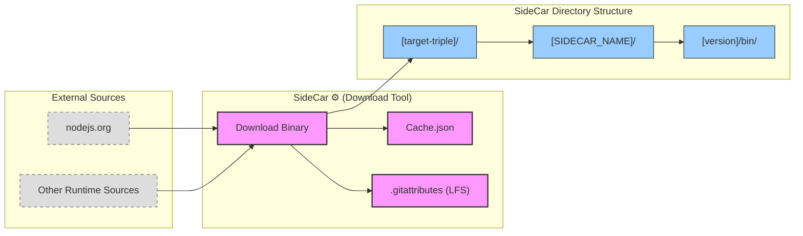

<table>
<tr>
<td align="left" valign="middle">
<h3 align="left"> SideCar</h3>
</td>
<td align="left" valign="middle">
<h3 align="left">
 ⚙️
</h3>
</td>
<td align="left" valign="middle">
<h3 align="left">+</h3>
</td>
<td align="left" valign="middle">
<h3 align="left">
<a href="https://Editor.Land" target="_blank">
<picture>
<source media="(prefers-color-scheme: dark)" srcset="https://PlayForm.Cloud/Dark/Image/GitHub/Land.svg">
<source media="(prefers-color-scheme: light)" srcset="https://PlayForm.Cloud/Image/GitHub/Land.svg">

</picture>
</a>
</h3>
</td>
<td align="left" valign="middle">
<h3 align="left">
<a href="https://Editor.Land" target="_blank">
Land
</a>
</h3>
</td>
<td align="left" valign="middle">
<h3 align="left">🏞️</h3>
</td>
</tr>
</table>

---

# **SideCar** ⚙️

Pre-Compiled Native Dependencies for Land 🏞️

**SideCar** is the central repository for all pre-compiled, platform-specific
sidecar binaries required by the **Land Code Editor** ecosystem. A "sidecar" is
a standalone executable that runs alongside the main `Mountain` application to
provide specialized functionality, such as the `Cocoon` extension host on
Node.js.

**What SideCar gives you:**

1. **No "install Node.js first".** Land ships its own Node.js binary. Users
   install the editor and it works. No prerequisites, no version conflicts.
2. **Every platform covered.** macOS (Intel + Apple Silicon), Windows (x64),
   Linux (x64 + ARM64). One build system handles all six targets.
3. **Deterministic binary selection.** Organized by target triple
   (`aarch64-apple-darwin`, etc.). The build picks the right binary at compile
   time.
4. **Automated fetching.** Download, cache, and verify Node.js binaries with
   Git LFS. No manual binary management.

📖 **[Rust API Documentation](https://Rust.Documentation.Editor.Land/SideCar/)**

---

## Directory Structure 📁

The SideCar directory is organized to allow deterministic selection by the build
system:

```
SideCar/
└── [target-triple]/
    └── [SIDECAR_NAME]/
        └── [version]/
            ├── bin/
            │   └── node
            ├── node.exe
            └── ... (other files from the distribution)
```

- **`[target-triple]`:** The platform-specific identifier used by Rust/Tauri
  (e.g., `x86_64-pc-windows-msvc`, `aarch64-apple-darwin`). This allows the
  build system to find the correct binary for the target platform.
- **`[SIDECAR_NAME]`:** The name of the runtime (e.g., `NODE`).
- **`[version]`:** The major version number of the runtime (e.g., `22`).

### How It's Used

The
[`Download`](https://github.com/CodeEditorLand/SideCar/tree/Current/Source/Download.rs)
Rust binary populates this structure. It fetches official distributions for
various sidecars and platforms and organizes them according to the convention
above.

During the application build, the main `Build.rs` orchestrator uses this
repository as a source. Based on build flags (e.g., `--node-version=22`), it
selects the appropriate executable from this directory and prepares it for
bundling into the final application installer.

---

## Key Features 🔐

- **Concurrent Downloads**: Parallel downloading of multiple runtime binaries
  using Tokio for maximum throughput.
- **Intelligent Caching**: Maintains a `Cache.json` file to track downloaded
  versions and avoid redundant downloads.
- **Version Resolution**: Automatically resolves major versions to latest patch
  from nodejs.org and other sources.
- **Git LFS Management**: Automatic `.gitattributes` updates for large binary
  tracking in Git LFS.
- **Platform Matrix**: Comprehensive support for x86_64 and aarch64
  architectures across macOS, Linux, and Windows.

---

## Core Architecture Principles 🏗️

| Principle                   | Description                                                                          | Key Components Involved                       |
| :-------------------------- | :----------------------------------------------------------------------------------- | :-------------------------------------------- |
| **Deterministic Selection** | Organize binaries by target triple for deterministic build-time selection.           | Directory structure, target triple convention |
| **Version Tracking**        | Maintain cache metadata to avoid redundant downloads and ensure version consistency. | `Cache.json`, version resolution              |
| **Git LFS Integration**     | Automatically manage Git LFS pointers for large binary tracking.                     | `.gitattributes` management                   |

---

## `SideCar` in the Land Ecosystem ⚙️ + 🏞️

| Component         | Role & Key Responsibilities                                           |
| :---------------- | :-------------------------------------------------------------------- |
| **Download Tool** | Populates the SideCar directory with pre-compiled runtime binaries.   |
| **Cache Manager** | Tracks downloaded versions in `Cache.json` for build reproducibility. |
| **Build Source**  | Provides vendored runtimes to `Mountain` during the build process.    |

---

## Getting Started 🚀

### Running the Download Tool

```sh
# Build the download tool
cd Element/SideCar
cargo build --release

# Run to download and organize all sidecars
./Target/release/Download
```

**Key Dependencies:**

- `tokio` — Async runtime for concurrent downloads
- `reqwest` — HTTP client for fetching binaries
- `serde`/`serde_json` — Cache.json serialization
- `git2` — Git LFS management

### Usage Pattern 🚀

The SideCar directory is populated once during project setup:

1. **Build Download Tool:** Compile the `Download` binary.
2. **Run Download:** Execute to fetch and organize all runtime binaries.
3. **Build Mountain:** The build system selects appropriate binaries from
   SideCar.

> [!NOTE]
>
> The contents of this directory are generated by the
> [`Download`](https://github.com/CodeEditorLand/SideCar/tree/Current/Source/Download.rs)
> Rust binary and consist of large, third-party binaries. This directory
> **should not be committed to version control** and should be added to the
> project's `.gitignore` file. The tool should be run once to vendor the
> dependencies as part of the initial project setup.
>
> ### Running the Download Tool
>
> ```sh
> # Build the download tool
> cd Element/SideCar
> cargo build --release
>
> # Run to download and organize all sidecars
> ./Target/release/Download
> ```

---

## System Architecture Diagram 🏗️

This diagram illustrates how `SideCar` vendors and organizes runtime
dependencies.



---

## Deep Dive & Component Breakdown 🔬

To understand how `SideCar`'s download tool works, see the following source
files:

- **[`Source/Download.rs`](https://github.com/CodeEditorLand/SideCar/tree/Current/Source/Download.rs)**
  — Main download binary entry point
- **[`Cache.json`](Cache.json)** — Download cache tracking file
- **[[`.gitattributes`](.gitattributes)](.gitattributes)** — Git LFS
  configuration for large binaries

The download tool handles concurrent downloads, version resolution from
nodejs.org, and automatic Git LFS management for tracking large binary files.

---

**Parent Project**:
[`Mountain`](https://github.com/CodeEditorLand/Mountain/tree/Current/README.md)
| **Related Directory**:
[`Binary`](https://github.com/CodeEditorLand/Mountain/tree/Current/Binary/README.md)

## License ⚖️

This project is licensed under Creative Commons CC0.

See the LICENSE file for details.

---

## Changelog 📜

Stay updated with our progress! See
[`CHANGELOG.md`](https://github.com/CodeEditorLand/SideCar/tree/Current/) for a
history of changes specific to **SideCar**.

---


## See Also

- [Architecture Overview](https://editor.land/Doc/architecture)
- [Mountain](https://github.com/CodeEditorLand/Mountain)
- [Air](https://github.com/CodeEditorLand/Air)

## Funding & Acknowledgements 🙏🏻

Code Editor Land is funded through the NGI0 Commons Fund, established by NLnet
with financial support from the European Commission's Next Generation Internet
programme, under grant agreement No. 101135429.

The project is operated by PlayForm, based in Sofia, Bulgaria.

PlayForm acts as the open-source steward for Code Editor Land under the NGI0
Commons Fund grant.

<table>
	<thead>
		<tr>
			<th align="left"><strong>Land</strong></th>
			<th align="left"><strong>PlayForm</strong></th>
			<th align="left"><strong>NLnet</strong></th>
			<th align="left"><strong>NGI0 Commons Fund</strong></th>
		</tr>
	</thead>
	<tbody>
		<tr>
			<td align="left" valign="middle">
				<a href="https://Editor.Land">
					
				</a>
			</td>
			<td align="left" valign="middle">
				<a href="https://PlayForm.Cloud">
					
				</a>
			</td>
			<td align="left" valign="middle">
				<a href="https://NLnet.NL">
					
				</a>
			</td>
			<td align="left" valign="middle">
				<a href="https://NLnet.NL/commonsfund">
					
				</a>
			</td>
		</tr>
	</tbody>
</table>

---

**Project Maintainers**: Source Open
([Source/Open@Editor.Land](mailto:Source/Open@Editor.Land)) |
[GitHub Repository](https://github.com/CodeEditorLand/SideCar) |
[Report an Issue](https://github.com/CodeEditorLand/SideCar/issues) |
[Security Policy](https://github.com/CodeEditorLand/SideCar/security/policy)
